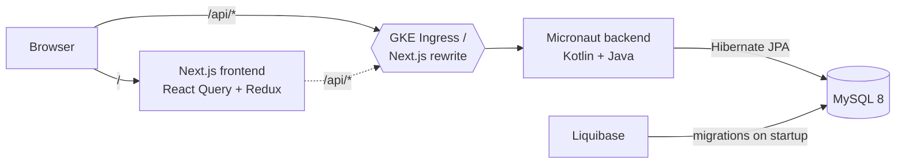
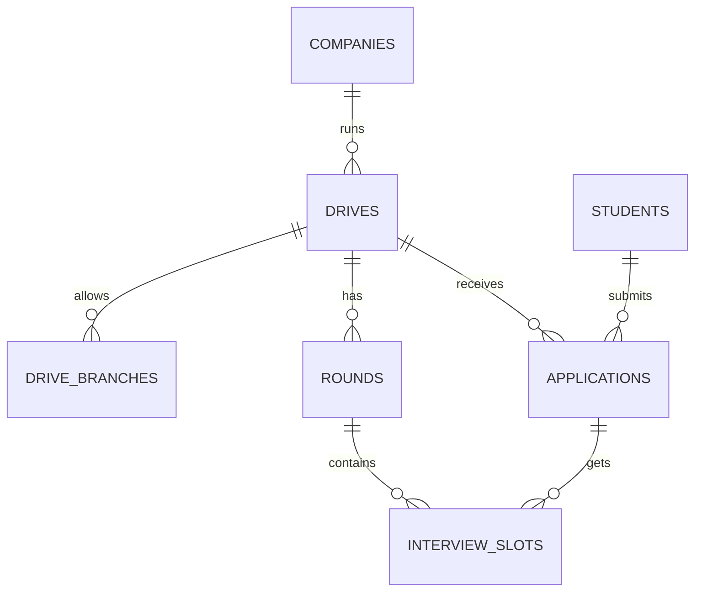

# Placement Drive Tracker

A full-stack app for a college **Training & Placement (T&P) cell**: manage companies, placement drives with
eligibility rules (CGPA / branch / backlogs), student applications, interview rounds and interview slots.

| Layer    | Tech |
|----------|------|
| Backend  | **Kotlin** + **Java** on **Micronaut 5**, Micronaut Data **Hibernate JPA**, **MySQL 8**, **Liquibase** migrations, Swagger/OpenAPI |
| Frontend | **Next.js 16** (App Router) + **React 19** + **TypeScript**, **React Query**, **Redux Toolkit**, **Tailwind CSS** + **styled-components** |
| Testing  | JUnit 5, **Testcontainers** (real MySQL in Docker), Micronaut HTTP client |
| DevOps   | **Docker** multi-stage builds, docker-compose, **Kubernetes** manifests for **GKE** (Ingress, HPA, StatefulSet), GitHub Actions CI + GKE deploy |

---

## Architecture



Backend code is split into simple layers:

```
controller/  -> HTTP endpoints only (read request, call service, return JSON)
service/     -> business rules (eligibility, status changes, slot clashes)
repository/  -> Micronaut Data interfaces (queries generated at compile time)
entity/      -> Hibernate JPA entities (map to MySQL tables)
dto/         -> request/response JSON classes (we never expose entities directly)
eligibility/ -> EligibilityChecker.java - plain Java, called from Kotlin
```

## Data model



Schema history (Liquibase, `backend/src/main/resources/db/changelog/`):

| Changeset | What changed | Why |
|-----------|--------------|-----|
| `001` | companies, students, drives, drive_branches, applications | first version |
| `002` | `students.active_backlogs`, `drives.max_backlogs` | companies started adding backlog rules - added as a **new** changeset, not by editing 001 |
| `003` | rounds, interview_slots | interview scheduling feature |
| `004` | demo data (`context="demo"`) | sample data locally; skipped in tests |

## Business rules

- A student can apply only if the drive is **OPEN**, and only **once** per drive (also enforced with a DB unique key).
- Eligibility: `CGPA >= minCgpa`, branch in allowed branches (empty = all), `backlogs <= maxBacklogs`,
  and **not already placed** (college "one student, one job" policy). All failing reasons are returned together.
- Application status can only move forward: `APPLIED → SHORTLISTED → SELECTED`, or `→ REJECTED`.
- Only **shortlisted** students can get interview slots, one slot per round.
- **Clash detection:** a student can't have two interviews at overlapping times, even for different companies.
- Failing an interview round automatically rejects the application.

## API (full docs at `http://localhost:8080/swagger-ui`)

| Method | Endpoint | Description |
|--------|----------|-------------|
| GET/POST | `/api/companies` | list / add companies |
| PUT/DELETE | `/api/companies/{id}` | edit / delete (blocked if it has drives) |
| GET/POST | `/api/students?branch=CSE` | list (filter by branch) / add students |
| GET | `/api/students/{id}/applications` | a student's applications |
| GET/POST | `/api/drives?status=OPEN` | list / create drives |
| PUT | `/api/drives/{id}/status` | OPEN / CLOSED / COMPLETED |
| GET | `/api/drives/{id}/eligibility` | every student + eligible or not + reasons |
| GET | `/api/drives/{id}/applications` | applicants of a drive |
| GET/POST | `/api/drives/{id}/rounds` | interview rounds |
| POST | `/api/applications` | apply `{studentId, driveId}` |
| PUT | `/api/applications/{id}/status` | shortlist / select / reject |
| GET/POST | `/api/rounds/{id}/slots` | list / book interview slots |
| PUT | `/api/slots/{id}/result` | PASSED / FAILED |
| GET | `/api/dashboard/stats` | placement %, branch-wise stats |
| GET | `/health` | health check (used by Kubernetes probes) |

---

## Running it

### Option 1 - everything in Docker (easiest)

```bash
docker compose up --build
```

- Frontend: http://localhost:3000
- Swagger UI: http://localhost:8080/swagger-ui

### Option 2 - run backend and frontend locally (for development)

Requirements: **JDK 25** (Micronaut 5 needs it), Node 22, Docker (for MySQL and tests).

```bash
# 1. start only MySQL
docker compose up -d mysql

# 2. backend on :8080
cd backend
./gradlew run

# 3. frontend on :3000 (in another terminal)
cd frontend
npm install
npm run dev
```

> **Windows note:** if Gradle fails with `Unable to establish loopback connection`, your Windows user folder
> probably has a space in it. Fix: `set JAVA_TOOL_OPTIONS=-Djdk.net.unixdomain.tmpdir=C:/gtmp` (create `C:\gtmp` first).

### Tests

```bash
cd backend
./gradlew test        # Docker must be running - Testcontainers starts a real MySQL 8.4
```

- `EligibilityCheckerTest` (Java) - unit tests for the rules, no database.
- `PlacementFlowTest` (Kotlin) - end-to-end over HTTP: create company → students → drive → eligibility →
  apply → duplicate/ineligible rejected → shortlist → rounds → slot → clash detected → select → dashboard.

---

## Deploying to Google Cloud (GKE)

```bash
# one-time setup
gcloud config set project YOUR_PROJECT_ID
gcloud services enable container.googleapis.com artifactregistry.googleapis.com
gcloud artifacts repositories create placement --repository-format=docker --location=asia-south1
gcloud container clusters create-auto placement-cluster --region=asia-south1

# build + push images
gcloud auth configure-docker asia-south1-docker.pkg.dev
docker build -t asia-south1-docker.pkg.dev/YOUR_PROJECT_ID/placement/backend:latest ./backend
docker build -t asia-south1-docker.pkg.dev/YOUR_PROJECT_ID/placement/frontend:latest ./frontend
docker push asia-south1-docker.pkg.dev/YOUR_PROJECT_ID/placement/backend:latest
docker push asia-south1-docker.pkg.dev/YOUR_PROJECT_ID/placement/frontend:latest

# deploy (edit YOUR_PROJECT_ID in k8s/kustomization.yaml and the passwords in k8s/mysql.yaml first)
gcloud container clusters get-credentials placement-cluster --region=asia-south1
kubectl apply -k k8s/
kubectl -n placement get ingress   # public IP appears after a few minutes
```

Or use the **Deploy to GKE** GitHub Action (`.github/workflows/deploy-gke.yml`) after adding the variables/secret listed at the top of that file.

What the manifests contain: MySQL `StatefulSet` with a persistent disk, backend `Deployment` (2 replicas,
readiness/liveness probes on Micronaut `/health`, `HorizontalPodAutoscaler` 2→5 pods on CPU), frontend
`Deployment`, and an `Ingress` that creates a Google Cloud load balancer routing `/api` → backend and `/` → frontend.

> GKE free tier covers one Autopilot cluster's management fee, but pods and the load balancer still cost money.
> Delete the cluster when you're done demoing: `gcloud container clusters delete placement-cluster --region=asia-south1`

---

## Things I'd improve next

- Login with roles (T&P admin vs student) using Micronaut Security + JWT
- Pagination on the student list (Micronaut Data `Pageable`)
- Cloud SQL instead of MySQL-in-Kubernetes, connected with the Cloud SQL Auth Proxy
- Email notifications when a student is shortlisted / gets a slot
- Optimistic locking (`@Version`) so two admins can't overwrite each other's status changes
